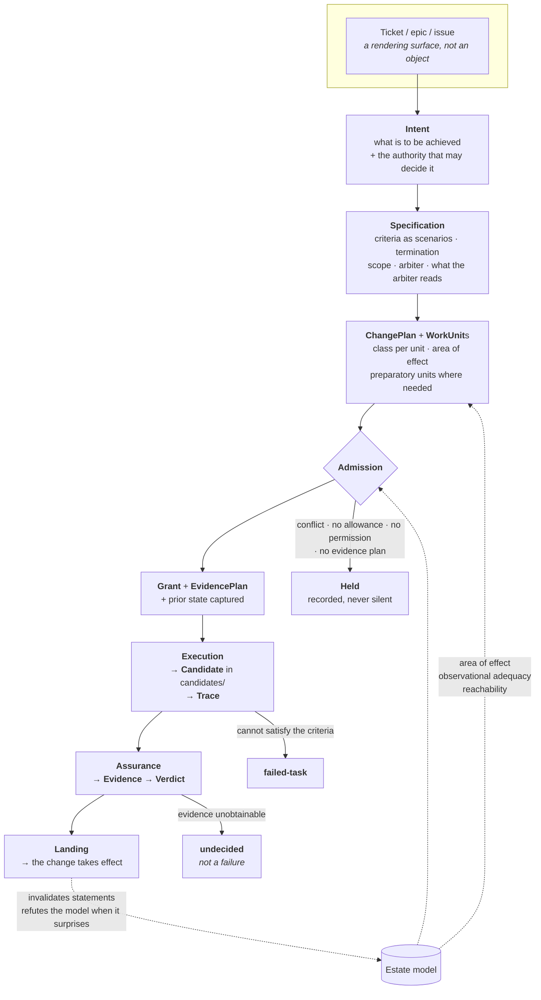
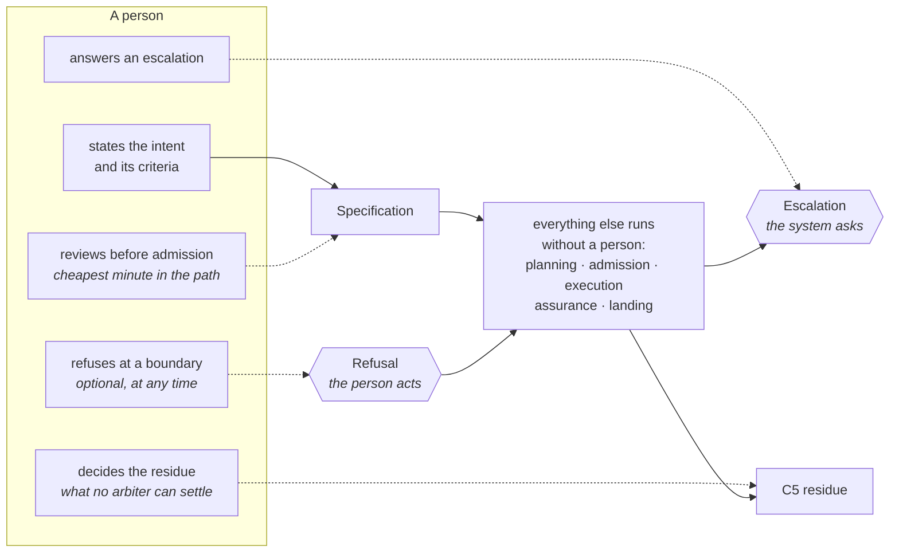
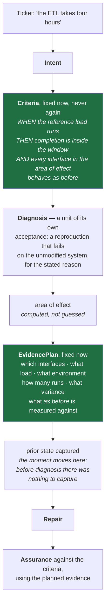
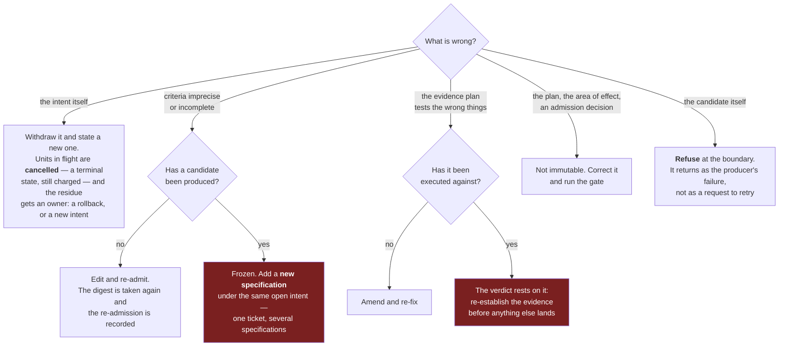

# The process, drawn

The path a change travels, what crosses each boundary, and where a person touches it. Companion to [iflow.md](iflow.md); nothing here is new, and where the two disagree the research document is right.

---

## 1. The path and its artefacts

Three edges are worth reading twice. Landing **refutes** the estate model when a change reaches beyond its predicted area of effect — that is the only mechanism that removes a false contract edge. `undecided` is a verdict, not an absence, and nothing lands on one. And a held unit is written down: silence is the single unacceptable outcome.

---

## 2. Where a person actually touches it

**Escalation is the system pulling; refusal is the person pushing.** The first is a rule that fires — an undecided verdict, a conflict no ordering resolves, a grant wider than policy, a consequence past a threshold. The second is available at any boundary and costs nothing when unused: a person who looks and disagrees returns the object to its producer as *that producer's* failure, not as a request to try again.

The boundary contracts as evidence accumulates, but **toward a floor rather than to zero**: the correctness of an intent cannot be established from inside the system, and a system cannot arbitrate itself.

---

## 3. A defect whose cause is unknown

The case where criteria and their evidence must be fixed at different moments.

The plan is derived from the **area of effect**, not from the candidate — the candidate does not exist yet. That, and not discipline, is what stops the evidence being shaped around the fix.

A performance criterion settled by one timing run rests on evidence that cannot be produced again: the environment, the load and the repetition count are not diligence, they are what makes the criterion satisfiable at all.

---

## 4. What to do when something is wrong

The legal move depends on **what** is wrong and **whether a candidate exists yet**.

**Why the criteria cannot simply be edited once a candidate exists.** Not strictness: criteria revised after the work exists describe the work rather than judging it, and the hypothesis fails at its first condition. Before a candidate exists that risk does not exist, which is why editing then is free and is the moment worth spending a minute on.

---

## 5. In enterprise vocabulary

| Their word | Here | Note |
|---|---|---|
| Epic | a group of intents | closes when every intent under it is satisfied |
| Issue / ticket | `Intent` | a rendering surface; one ticket may spawn several specifications |
| Requirements | `AcceptanceCriteria` | fixed at intake, in the vocabulary of the symptom, never edited after a candidate exists |
| **Definition of Ready** | the admission conditions | criteria complete · no conflict · an allowance exists · a grant no wider than scope can be issued · an evidence plan where one is needed |
| **Definition of Done** | verdict `met` on every criterion, then landed | on evidence produced independently of the executor, not on someone having read it |
| Test plan | `EvidencePlan` | written from the area of effect, after diagnosis, before the repair |
| Tests, QA | the **arbiter** | outside the scope by construction; a change may not edit what judges it |
| Code review | not the mechanism of acceptance | a person may **refuse**; approval by reading is not what makes a change accepted |
| Ticket closed | `Intent` → satisfied | a different event from any one change being accepted |

The two rows that will feel strangest to an enterprise reader are the last two, and they are the point. Acceptance rests on evidence rather than on review, because review does not scale and cannot be measured; and a ticket closing is not the same event as a change being accepted, because one ticket legitimately produces several.
